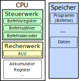

Hardware
========

Mainboard
=========

Formfaktoren
------------

Normierungen für Mainboards, beschreiben:

- Abmessungen des gesammten Mainboards
- Arten, Anzahl und Lage der Anschlüsse
- Position und Art der Befestigungspunkte

Beispiele: ATX, BTX, ITX, (Micro, Nano, Mini, etc.)-ITX mit integriertem Passierschein A-38, etc.

Prozessorzyklus
===============

Ablauf von einem Programm:
--------------------------

0- Startbefehlsadresse in den Befehlszähler laden

1- Befehlszähler an RAM senden 

2- RAM holt befehl aus der Speicheradresse und sendet ihn an den Prozessor über eine
   Busleitung (Befehlsregister)
   
3- Befehl decodieren und Steuerbefehle für alle beteiligten Baugruppen bilden 

4- Ausführung

5- Befehlszähler erhöhen (in der regel um 1)

Prozessoraufbau	
===============

Es war einmal der __von-Neumann-Rechner__: 1 Bus für Befehle, Addressen und Daten,
diese stellten einen Flaschenhals dar.

Dann kam die __Harward-Architektur__: Je ein Addressbus, Befehlsbus und Datenbus.

- Register: Speichern numerische Werte
- Akkumulator: Ein besonderes Register, in das Ergebnisse von Operationen gespeichert werden.
- Rechenwerk
	- *Arithmetic Logic Unit*: Führt Arithmetische und Logische operationen aus.
	- *Floating Point Unit*: Kann besser mit Gleitkommazahlen rechnen als ALU.
- Steuerwerk
	- Befehlsregister: Speichert aktuellen Befehl (in Binärer representation)
	- Befehlsdecoder: Wandelt Befehl in die entsprechenden Operationen um, die die Hardware letztlich durchführt.

(Steuerwerk)     (Befehl/Steuer Bus)

Befehlsdecoder <---------------------- Befehl

Befehlsregister

Befehlszähler   ---------------------> Befehl
			(Adressen)

(Rechenwerk)
